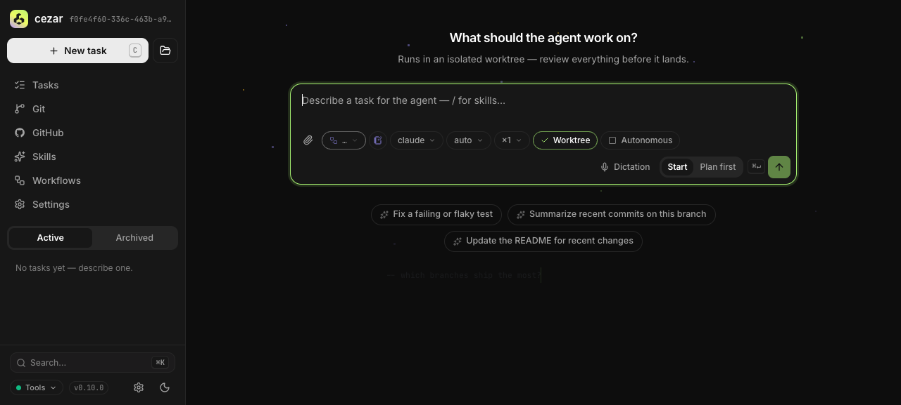

# Task loops — drain a list of work items as a sequence of separate sessions

> Brief: [`briefs/2026-08-19-task-loops.md`](briefs/2026-08-19-task-loops.md) · **Blocked on:** the postponed-tasks foundation (PR #846, epic #771 — unmerged; spec lives on upstream branch `spec/scheduled-tasks`, not in this tree) · Wants: "an autonomous run delivers a draft PR" (not yet specified — see Q3) · Related: `2026-07-25-github-automations.md`, `2026-07-18-optional-review-gate.md`

## TLDR

A **loop** runs an ordered list of independent work items as a strict sequence of ordinary cezar tasks — one session, one worktree, one branch per item — advancing only when the previous item's run reaches a terminal state. The loop counter lives in a persisted, project-local definition driven by the workspace coordinator, not in an agent's context window, so a server restart resumes it instead of losing it. Put precisely: **a scheduled task fires when the clock strikes; a loop fires when the previous run finishes.** That barrier, and the set of ways an awaited run can fail to finish, is the whole of this spec.

**What a loop does not do:** it does not land anything. On a zero-config install each item ends as a branch, not a PR (see Problem Statement). Making an autonomous run deliver a reviewable artifact is a real gap, but it is a defect of autonomous runs in general, not of loops, and it is specified separately (Q3).

## Resolved assumptions (autonomous defaults)

| # | Question | Applied default | Why | Confirm? |
|---|----------|-----------------|-----|----------|
| Q1 | One deployable capability, or a bundle? | **One slice: item list + loop object + barrier + UI.** Issue-sourced queues, per-item landing, and per-item draft PRs are each excluded. | Each functions without the others; bundling produces an unsplittable spec. Reverses an earlier "issues + list in v1" answer. | ⚠ NEEDS HUMAN CONFIRMATION |
| Q2 | Build on unmerged PR #846, or ship standalone? | **Build on it.** Not implementable until #846 lands. Every claim about its seams below is written conditionally, because none of them exist in this tree yet. | Epic #771 forbids "a second scheduler, store, route family, or launch path"; shipping standalone clones a 1231-LOC module a third time. | ⚠ NEEDS HUMAN CONFIRMATION |
| Q3 | What does a finished item deliver? | **A branch, and nothing more.** Draft-PR-per-item is **removed from this spec** and becomes a prerequisite spec covering autonomous runs generally. | `settleSuccess` leaves *every* autonomous run as a `done` run with no PR — a general defect. Fixing it inside `loops/` would create two divergent settle behaviors and leave the general case broken. Consequence: until that spec lands, a loop delivers N branches, which is less than the original request asked for. | ⚠ NEEDS HUMAN CONFIRMATION |
| Q4 | What counts as "item finished"? | `done` \| `review` \| `cancelled` \| (`failed` **with no pending `autoResumeAt`**). Everything else is a bounded wait with an explicit deadline and a reason string. | Forced by the code — see Edge Cases. | ok |
| Q5 | A stalled `monitoring` item — advance past it? | **No. Pause the loop and surface the stalled item.** | Advancing while the run stays alive would put two live children in a width-1 loop, and beyond `maxMonitoringSessions()` they consume real capacity (`run.ts:810-814`). Cancelling instead would destroy possibly-good work. Pausing costs unattended progress; it is the only option that neither lies nor destroys. | ⚠ NEEDS HUMAN CONFIRMATION |
| Q6 | Per-loop knobs? | **None.** Stall and launch deadlines are module constants; forge availability is discovered, never configured. | `AGENTS.md`: "When a feature seems to need configuration, the design is wrong. Discover it, or default it." Reverses two earlier per-loop-switch answers, which were given against a state machine that is not the one in the code. | ok |
| Q7 | Width > 1? | **No. Strictly sequential**, no knob. | Sequencing is the point; parallel fan-out is what variants and automations already do. | ok |
| Q8 | Gating | `CEZ_LOOPS=1`, **permanently** off by default, exactly like `CEZ_AUTOMATIONS` (`README.md:519`). No removal phase. | A capability that spawns N unattended paid sessions is precisely AGENTS.md's "widens exposure or cost → opt-in behind a `CEZ_*` flag, off by default". Removing the flag later would also breach BACKWARD_COMPATIBILITY §1, which requires a deprecated alias plus warning for at least one minor release. | ok |
| Q9 | New provenance field, or generalize the existing ones? | **Extract the source-neutral launch adapter as its own landed change first**, then add `loop?` provenance additively. `automation?` (`runs/store.ts:174-183`) is untouched. | The foundation spec defers a "source-neutral extraction … when a third caller needs it" — this is that caller. The extraction is behavior-preserving and independently deployable, so it ships alone against #846's tests rather than inside a loops PR. | ok |
| Q10 | Does starting a loop need a confirmation step? | **Yes, required.** The primary button reads "Review and start" and opens a step stating the item count and that nothing is merged. | Starting a loop is the one consequential, hard-to-reverse action in the feature — it spawns N unattended paid sessions. Without the step, the composer's cheapest gesture is its most expensive. Not a preference, so not a setting. | ok |
| Q11 | Reuse `groupId` for parentage? | **No** — loop children carry no `groupId`, so the variant loser-sweep is unreachable by construction. Keep one cheap regression test; **no route change**. The real work is not rendering Compare for loop parents. | `groupRuns` filters on `groupId` and the route 404s on an empty set (`server.ts:4247-4251,4290`), so a guard would be a no-op. | ok |

## Problem Statement

Draining a queue of N independent work items costs N rounds of babysitting: start a task, watch it, review it, start the next. Upstream `open-mercato/cezar` carries 80 open issues, so the backlog is real.

Two verified facts constrain the design:

- **Nothing lands today.** `reviewGateEnabled` (`runs/review-gate.ts:16-22`, #489) is off unless `config.reviewGate` is set or `CEZ_REVIEW_GATE === '1'` exactly, and `settleSuccess` (`workflows/run.ts:3294-3325`) parks at `review` only when `worktreeHasDiff && reviewGateEnabled(config) && run.autonomous !== true`. Ten autonomous children therefore produce ten `done` runs and zero PRs. This spec does **not** fix that (Q3); it stops pretending a loop can.
- **Sequential *starts* are already free; serialization is not.** Per-project `maxParallel` is a setting (`workspace/semaphore.ts:276-286`) and the queue is FIFO among startable runs (`run.ts:900-910`). But `maxParallel: 1` does not serialize: `busySlots()` subtracts ordinary `waiting` runs (`run.ts:810-814`, the #347 exemption), so the next child starts while the previous session is still open. The missing pieces are exactly: fan-out from a source, **the completion barrier**, and durable per-item receipts.

Counter-evidence kept in view: issue #881 records that **24 of the 80 open issues already carry an open PR** and that batching such work "just creates conflicts". The eligible queue is far smaller than the backlog — a large part of why issue-sourced queues are a separate spec.

## Goals

- Run an ordered list of items as ordinary cezar tasks, strictly one at a time, each in its own worktree and session.
- Survive a server restart mid-loop, resuming at the correct item without duplicating or losing a launched item.
- Never wait forever: every non-terminal path has a deadline and a durable reason string.
- Make progress legible: a loop row with its children, and one receipt per item explaining every advance, skip, stall and pause.
- Consume the postponed-tasks foundation's coordinator, lease and occurrence discipline rather than restating them.

## Non-goals

- **Auto-merging item work** — excluded by #771.
- **Per-item draft PRs / making autonomous runs deliver an artifact** — prerequisite spec, not this one (Q3).
- **Issue-sourced queues** — follow-up spec, including the eligibility problem (#881: umbrella issues, decision issues, issues already carrying a PR) which cannot be decided from metadata alone.
- **Dependent step sequences** — that is what workflows are for (`workflows/run.ts`, `onFail.retry`). A loop is for items that would each function without the others.
- Parallel loops, width > 1, recurrence, cron-shaped triggers.
- **A second coordinator, lease, occurrence model or launch path.** This spec adds its own definition/state/receipt files and route family — which #771's "no second store or route family" is not read to forbid, since a loop definition is a different shape from a schedule; what it forbids, and what this spec honors, is a parallel *mechanism* for timing, leasing, launching and reconciling.
- Agent judgement inside the coordinator.

## Proposed Solution

Persist a project-local loop definition (ordered items plus one task template) and a runtime cursor. The workspace coordinator introduced by the foundation gains a second trigger kind: where a scheduled task arms a timer, a loop **observes run completion**. When the run recorded as the loop's current item settles, the controller reserves the next item under the project lease and launches it through the shared adapter.

Alternatives rejected:

- **An agent session as orchestrator** (the original request). A parked orchestrator has only three wake sources — user message, turn-end nudge, monitoring wake timer — and its plan dies with the process; `RunManager`'s constructor takes only `{ semaphore? }`, so there is no completion-callback seam to hand it. The store's `EventEmitter` (`store.ts:574`) is the seam, and only server-side code can hold it.
- **A third automations-shaped module.** Forbidden by #771; the last one measured 39 files / +2872 lines.
- **`maxParallel: 1` plus a bulk enqueue.** Fails on the `waiting` exemption above; no barrier, no receipts, no resume.

## Architecture

### The barrier

`packages/cezar/src/loops/barrier.ts` answers one question per store event: *is the run this loop awaits finished?* Two store properties force its shape:

- The store emits `run` on every mutation via `touch()` (`store.ts:1172-1174`) — there is no terminal event — so the barrier keeps an O(1) map from awaited run id to loop id and diffs against its own last-seen status. It never scans.
- `runs.json` saves are debounced (`store.ts:1195-1202`), so the barrier reuses the foundation's launch discipline exactly: reserve the receipt, build the run record with `loop` provenance **at construction**, synchronously flush, then let the manager pump. Provenance is never patched on after `startRun` returns.

**A store event is necessary but not sufficient.** Three paths end an awaited run's life without a usable `run` event, each verified:

- `pruneOldRuns` does `this.runs.delete(stale.id)` with **no `touch()` and no emit** (`store.ts:1177-1180`), bounded by `MAX_RUNS_KEPT` / `MAX_ARCHIVED_KEPT`. The awaited run can vanish in total silence.
- `deleteRun` emits `'deleted'` (`store.ts:1120`) — a second event name the barrier must subscribe to.
- A `queued` run can wait indefinitely: `run.ts:903-909` skips queued runs whose agent account is held, breaking out when everything queued is blocked on a held account.

So the barrier is **event-driven with a reconciling floor**: alongside the two subscriptions it runs one unref'd low-frequency sweep (`RECONCILE_INTERVAL_MS`, 60 s) that re-reads the awaited run id from the index. A missing record is classified `awaited-run-vanished`; a run still `queued` past `LAUNCH_DEADLINE_MS` (30 min) is classified `never-started`. Both write a receipt and pause the loop rather than advancing silently.

Advance is serialized by the project lease, so two cezar processes cannot both advance one loop.

### Source-neutral launch adapter (lands first, alone)

`packages/cezar/src/runs/launch-source.ts` — a neutral `(template, workflowContext, provenance) → StartRunInput` adapter plus the provenance-at-construction and synchronous-flush call. Extracted from the foundation's scheduled launch path, behavior-preserving, and shipped as its own change against #846's tests before any loops code exists. GitHub Automations is **not** migrated: its runtime functions take a `GithubCandidate` and carry untrusted-event placeholders, making it a separate and riskier refactor.

`RunRecord` then gains `loop?: { loopId, revision, receiptId, itemId, itemIndex, trigger: 'loop' | 'manual' }` — optional and additive, like `automation?`.

### Modules

- `packages/cezar/src/loops/types.ts` — definition, runtime-state and receipt schemas.
- `packages/cezar/src/loops/store.ts` — project-local files under the shared project lease, with per-entry salvage, atomic rename, append-only receipts and compaction (persistence rules per AGENTS.md § workspace registry; not restated here).
- `packages/cezar/src/loops/barrier.ts` — terminal classification, the reconciling sweep, the advance decision.
- `packages/cezar/src/loops/controller.ts` — attach/detach per project, boot resume, reconciliation.
- `packages/contract/src/loops.ts` — request/response schemas, types inferred.
- `packages/web/src/routes/loops/` — list, detail with item timeline, editor.
- `packages/web/src/lib/task-groups.ts` and `packages/web/src/components/task-quick-list.tsx` — loop parentage in the task list, and suppressing the variant Compare affordance for loop parents.

The controller is demand-independent and must not use the WebSocket topic bus; it publishes an additive `loop-change` event on the existing workspace SSE stream, following the `automation-change` precedent (`server.ts:507-515`). Only the loop views subscribe, at their own lifetime.

### Lifecycle and project disposal

1. Server listens; the coordinator scans registered non-missing roots for the optional `loops.json`.
2. No enabled running loop → nothing is observed, and no project context is instantiated.
3. A project **with** a running loop must be instantiated at boot to observe its store. This is a deliberate, named exception to the lazily-built-context invariant (`project-context.ts:16`), bounded by the number of running loops.
4. On a terminal transition of an awaited run: acquire the lease, re-read definition and state, finalize the finished item's receipt, select the next `pending` item.
5. Reserve one receipt keyed `${loopId}:${revision}:${itemId}`, launch through the shared adapter with `loop` provenance, flush synchronously, finalize the receipt with the run id, publish one change event, await the new run.
6. No `pending` items remain → the loop is `completed`; the controller detaches.
7. `ProjectContexts.dispose(projectId)` (`project-context.ts:189`, `ctx.manager.dispose()` at 243) — the controller detaches its observers first, writes a `project-detached` receipt on any in-flight item, and leaves the loop `paused`; re-registering the project resumes it through the ordinary boot path.
8. Shutdown detaches observers, leaving unresolved reservations to startup reconciliation.

Startup reconciliation mirrors the foundation: a reserved receipt with a matching run finalizes without relaunch; a reserved receipt with no run becomes `launch-error` with explicit retry of that item; an item is `completed` only once its run is durably visible. Editing increments `revision`; a reserved or launched item is immutable; a pending item may be removed, the in-flight one may not.

## Data Model

Three optional project-local files, all following the persistence discipline in AGENTS.md § workspace registry (`.passthrough()`, per-entry salvage, lease-guarded re-read/merge-write, atomic tmp+rename, `0600`). Filenames, temp variants and the lock are added to `ensureDataGitignore` in the same commit.

### `.ai/cezar/loops.json`

```ts
type LoopDefinition = {
  id: string
  revision: number
  name: string
  description?: string
  status: 'idle' | 'running' | 'paused' | 'completed'   // single source of truth
  pausedReason?: string                                  // set with 'paused'
  items: LoopItem[]                                      // ordered, max 100
  task: LoopTaskTemplate                                 // one template for every item
  createdAt: string
  updatedAt: string
}

type LoopItem = { id: string; prompt: string }           // status lives on receipts only
```

`status` is the only lifecycle representation — there is no separate `enabled` flag to contradict it, and item outcome is read from receipts rather than duplicated on the item. Stall and launch deadlines are module constants, not fields.

`LoopTaskTemplate` derives from the same `createRunInputBaseSchema` (`packages/contract/src/runs.ts:611`) the foundation's template uses — omitting `task`, `images`, `todoId`, adding `prompt` — so item task semantics have one source.

### `.ai/cezar/loop-state.json`

Per loop: `revision`, `status`, `currentItemId`, `awaitedRunId`, `awaitedSince`, `lastReceiptId`, `completedCount`, `skippedCount`. Validated against the definition on boot; stale or corrupt cache is repaired, never trusted.

### `.ai/cezar/loop-receipts.ndjson`

Append-only latest-state rows: sequence, receipt id/key, loop id/revision, item id/index, trigger, status (`reserved` | `completed` | `skipped` | `launch-error` | `stalled` | `vanished` | `never-started` | `project-detached`), reason, run id, observed and updated timestamps. Never stores prompt or system-prompt text, and never credentials. Compacted under the lease beyond 20,000 lines, retaining all unresolved rows plus the latest 10,000 terminal ones.

## API Contracts

Zod-first in `packages/contract`, one chained project-scoped route family, middleware-validated, `/api/v1` with boot-project and `/api/v1/p/:projectId` parity, and a BACKWARD_COMPATIBILITY §2 inventory entry in the same commit — per AGENTS.md § The HTTP API, not restated here.

Standard CRUD over `/api/v1/loops` and `/api/v1/loop-receipts` (list, create, read, `PUT` with `expectedRevision` → 409 on mismatch or lease contention, delete, cursor-paged receipts capped at 100). Only the non-obvious semantics are specified:

- `DELETE /api/v1/loops/:id` — already-launched runs, branches and worktrees are left alone.
- `POST /api/v1/loops/:id/pause` — does **not** cancel the in-flight item; it only stops the next launch.
- `POST /api/v1/loops/:id/resume` — clears `pausedReason`; if the awaited run has since settled, the next item launches immediately.
- `POST /api/v1/loops/:id/skip-current` — the only supported way past a stalled item (Q5): records the current item `skipped` and advances. Cancelling the stalled run remains the user's separate, explicit action on that run.
- `POST /api/v1/loop-receipts/:receiptId/retry` — 202 only for an unresolved `launch-error` with no reconciled run.

## UI/UX

Three surfaces, specified as an interaction contract. Copy below is the literal
string to ship, not a description of it.

Current state, captured from the running app for reference:




The composer already carries the two controls a loop sits between: **`×1`**,
the parallel-variants dropdown, and the **`Start` / `Plan first`** segmented
control. A loop is the *sequential* sibling of `×1` — same "how many agent
sessions does this gesture create" question, opposite answer about ordering.
Placing it as a third `Start`/`Plan first`-style mode keeps that adjacency
visible instead of hiding it in a separate page.

### Composer — "Loop" mode

Entry point: a `Loop` option in the existing `Start` / `Plan first` segmented
control, present only when `CEZ_LOOPS=1`. Selecting it swaps the single prompt
textarea for the items field below and disables `×1` (variants and loops are
mutually exclusive — `×1` fans one task out in parallel, a loop runs many tasks
in sequence), with the hint **"Variants are off while Loop is on."**

- Items field label: **"Items — one per line"**; helper text:
  **"Each line starts its own task, in its own worktree. They run one at a
  time, in order."** Blank lines are ignored; live counter reads
  **"12 items"** (singular **"1 item"**).
- Every ordinary New task choice (workflow, skills, runner, model, autonomy)
  renders unchanged below and applies to every item. No second form.
- Over 100 items the field shows **"Loops are limited to 100 items. Remove
  {n} to continue."** and the submit button is disabled.

**Consequential-action control.** Starting a loop spawns N unattended paid
sessions — the one hard-to-reverse action here — so the primary button reads
**"Review and start"**, never a bare "Start", and opens a confirmation step
stating scale before anything launches:

> **Start this loop?**
> 12 items will run one at a time, each as its own task with its own worktree
> and branch. Each one is a real agent session.
> Nothing is merged. You review the branches yourself.
> `[Cancel]` `[Start 12 items]`

This step is required rather than a preference: without it the composer's
cheapest gesture is also its most expensive.

### Loops list

- Row: name, status pill (`Idle` / `Running` / `Paused` / `Completed`),
  progress as **"4 of 12 done · 1 skipped"**, and relative time of the last
  advance.
- Empty state heading: **"No loops yet"**; body: **"A loop runs a list of tasks
  one at a time — each in its own worktree, in the order you write them."**;
  action: **"New loop"**.
- Loading: skeleton rows. Load failure: **"Couldn't load loops."** with
  **"Try again"**.

### Loop detail

- Header: name, status pill, progress line, and `Pause` / `Resume` /
  `Delete loop` actions. `Delete loop` confirms with **"Delete this loop?
  Tasks it already started keep running, and their branches are kept."**
- **Item timeline**, one row per item in order: index, first line of the
  prompt, per-item status, a link to its run, and — whenever the status is not
  `Done` — the reason string. Reasons are the debuggability contract, so they
  are always shown, never behind a tooltip:

  | Status | Row reads |
  |---|---|
  | `Done` | **"Done · branch `cez/ab12cd34`"** |
  | `Running` | **"Running · started 4 min ago"** |
  | `Queued` | **"Waiting for a free slot"** |
  | `Skipped` | **"Skipped · you cancelled this task"** / **"Skipped · you deleted this task"** |
  | `Stalled` | **"Stalled · this task has been monitoring for over an hour"** |
  | `Vanished` | **"Stopped · this task's history was pruned, so the loop can't tell whether it finished"** |
  | `Never started` | **"Never started · no free agent account for 30 minutes"** |
  | `Launch error` | **"Couldn't start · {reason}"** with **"Retry this item"** |
  | `Pending` | **"Not started yet"** |

- **Paused banner** — the primary recovery path, not an error state. It names
  the cause and offers exactly the two moves that exist:

  > **Paused — item 5 has been monitoring for over an hour.**
  > The task is still running; the loop won't start item 6 until you decide.
  > `[Resume loop]` `[Skip item 5]` — and a link, **"Open item 5"**, for
  > cancelling that run explicitly, which stays the user's own action on the
  > run.

- Permission/availability state: with `CEZ_LOOPS` unset the nav item and routes
  are absent entirely (`409` from the endpoints), matching `CEZ_AUTOMATIONS`.

### Task list parentage

Loop children render under a loop parent row via the `loop` relation, never
`groupId`; the variant Compare affordance is not rendered for loop parents.

Standard requirements apply unchanged and are not restated: light/dark/system
theming, mobile safe areas, keyboard access, and focus handling on the
confirmation step.

## Edge Cases & Failure Scenarios

| Situation | Behavior |
|---|---|
| `waiting` (agent asked a question) | **Not special.** `armIdleTimer` calls `session.end()` (`run.ts:3378-3390`), the result resolves and `settleSuccess` runs, bounded by `IDLE_TIMEOUT_MS` = 15 min. The barrier waits. |
| `monitoring` | **Not terminal**, and not advanced past. A sub-state of `running` that deliberately clears the idle timer, bounded only by `MAX_AUTO_CONTINUES = 40` wakes (`run.ts:196`). Past `STALL_DEADLINE_MS` (60 min) the loop writes a `stalled` receipt and **pauses** (Q5), leaving the run alive. |
| `failed` + pending `autoResumeAt` | **Not terminal.** The run has an appointment to resume itself (`store.ts:200`; the comment at ~838 explains such a run "is not a done item AT ALL"). Advancing would put two children live in a width-1 loop. |
| Restart transits `running` → `failed` | Ignored; `failed` is acted on only once no pending resume remains, so a restart never spuriously fails an item. |
| Awaited run pruned from the index | `pruneOldRuns` emits nothing (`store.ts:1177-1180`). The 60 s reconcile sweep detects the missing record, writes `vanished`, and pauses. |
| Awaited run deleted by the user | The `'deleted'` subscription (`store.ts:1120`) writes `skipped` / reason `deleted-by-user` and advances. |
| Awaited run never leaves `queued` | Past `LAUNCH_DEADLINE_MS` (30 min) — e.g. a held agent account (`run.ts:903-909`) — writes `never-started` and pauses. |
| Item's run cancelled by the user | Terminal; `skipped` / `cancelled-by-user`; the loop advances. |
| Project removed from the registry mid-loop | Observers detach, `project-detached` receipt, loop left `paused`; re-registering resumes it. |
| Worktrees reclaimed underneath the loop | `worktreeRetentionDefault` is **10** (`workspace/config.ts:119`) and `selectReclaimableWorktrees`/`reclaimWorktrees` (`runs/retention.ts:37,105`) reclaim finished worktrees beyond it, keeping branches. A 100-item loop therefore ends with 100 branches and ~10 worktrees. The loop never depends on a finished item's worktree, and the UI links the branch, not the directory. |
| Two cezar processes on one project | The lease serializes advance; the loser gets a bounded busy/409 and never writes unlocked. |
| Corrupt or read-only `loops.json` | Per-entry salvage; a wholly unreadable file degrades to "no loops" with one warning, never a boot failure. |
| Workspace capacity full | A launched item is an ordinary run and queues under normal capacity, subject to the `never-started` deadline above. |

## Risks & Impact Review

- **Sequencing risk (highest).** Not implementable before PR #846 lands; both features contend for the same sidebar area, the same post-`listening` boot ordering, and the same provenance surface. Every foundation reference here is conditional by construction.
- **Delivery risk from Q3.** Until the autonomous-artifact spec lands, a loop's output is N branches. If that is unacceptable, this spec should not ship first.
- **Blast radius.** New modules plus one additive `RunRecord` field, one route family, one composer mode, and the two task-list files. The only change outside `loops/` is the launch-adapter extraction, which lands separately and behavior-preserving.
- **Compatibility.** `POST /api/v1/runs`, immediate New task, `/new` deep links, workflow YAML, skill Markdown and automation wire shapes are unchanged. New state is optional, salvageable and boot-safe. `CEZ_LOOPS` is permanently off by default, so no env-var deprecation is ever required.
- **Cost.** A loop launches real agent sessions serially; the item count is visible before start and every launch is receipted.
- **Rollback.** Unset `CEZ_LOOPS` and the surface disappears and nothing is observed; delete the three state files and cezar rebuilds what it needs. Already-launched runs survive independently.
- **Known gap.** #689 ("classify inactivity closures before finalizing runs") is a prerequisite for trustworthy stall classification; until it lands, `stalled` is a timeout, not a diagnosis.

## Testing Strategy

- Fake-clock barrier tests, one per non-terminal path: `waiting`, `monitoring` + stall pause, `failed` + `autoResumeAt`, restart transit, **pruned run**, **deleted run**, **indefinitely queued run**.
- Persistence: corrupt-entry salvage, revision conflict → 409, lease contention → busy, atomic-rename torn-write resistance.
- Crash window: reserved receipt with and without a matching run, asserting reconciliation finalizes rather than relaunching.
- Project disposal mid-loop, asserting detach + `project-detached` + resumability.
- Contract-parity, route-parity and typed-bodies coverage for the new family.
- A regression test asserting loop children are never treated as a variant group.
- React tests for composer item parsing and the item timeline; one three-item drain in the browser under `CEZ_DRY_RUN=1`.
- Regression tests are proven red without the fix, per AGENTS.md § "Prove the regression test fails without the fix".

## Phasing

### Phase 0 — the extraction (separate, before any loops code)
`runs/launch-source.ts` extracted from the foundation's scheduled launch path, behavior-preserving, scheduled-task tests green.

### Phase 1 — the barrier and one working drain (behind `CEZ_LOOPS=1`)
Storage, `loop?` provenance, the barrier with all seven wait paths, start/pause/resume/skip-current, composer mode, loop detail timeline, task-list parentage.

### Phase 2 — hardening and evidence
Receipt compaction, `launch-error` retry, project-disposal path, browser evidence of a real three-item drain. The `CEZ_LOOPS` flag stays.

## Implementation Plan

**Phase 0**

1. `runs/launch-source.ts`: neutral adapter + provenance-at-construction + synchronous flush, extracted from the foundation. Scheduled-task suites unchanged and green; a test asserts provenance is never patched post-`startRun`.

**Phase 1**

2. `loops/types.ts` — schemas with salvage; tests for corrupt-entry salvage and unknown-key survival.
3. `loops/store.ts` — lease-guarded re-read/merge-write, atomic rename, append-only receipts; `ensureDataGitignore` updated in the same commit.
4. `RunRecord.loop?` provenance threaded through the Phase 0 adapter.
5. `loops/barrier.ts` — terminal classification plus the reconciling sweep; one test per wait path, including pruned, deleted and never-started.
6. `loops/controller.ts` — attach/detach, boot resume, reconciliation of reserved receipts, project-disposal detach.
7. `packages/contract/src/loops.ts` + chained route family + middleware validation; contract-parity, route-parity, typed-bodies, BACKWARD_COMPATIBILITY §2 entry.
8. Composer Loop mode as a third `Start`/`Plan first` option (item parsing, live count, 100-item ceiling, `×1` disabled while Loop is on) **and the required "Review and start" confirmation step stating item count and that nothing is merged**; React tests cover parsing, the ceiling message, variant mutual-exclusion, and that no launch happens without confirmation.
9. Loops list + detail timeline with reason strings and the paused-loop affordance.
10. Task-list parentage in `task-groups.ts` / `task-quick-list.tsx`; Compare suppressed for loop parents; regression test that loop children are never a variant group.
11. `CEZ_LOOPS` gate wired; `.env.example` and the README env table updated in the same commit.

**Phase 2**

12. Receipt compaction and the `launch-error` retry route.
13. Browser coverage of a three-item drain under `CEZ_DRY_RUN=1`.

Each step leaves the application working: Phase 0 is behavior-preserving, and through step 10 the feature is invisible without the flag.
